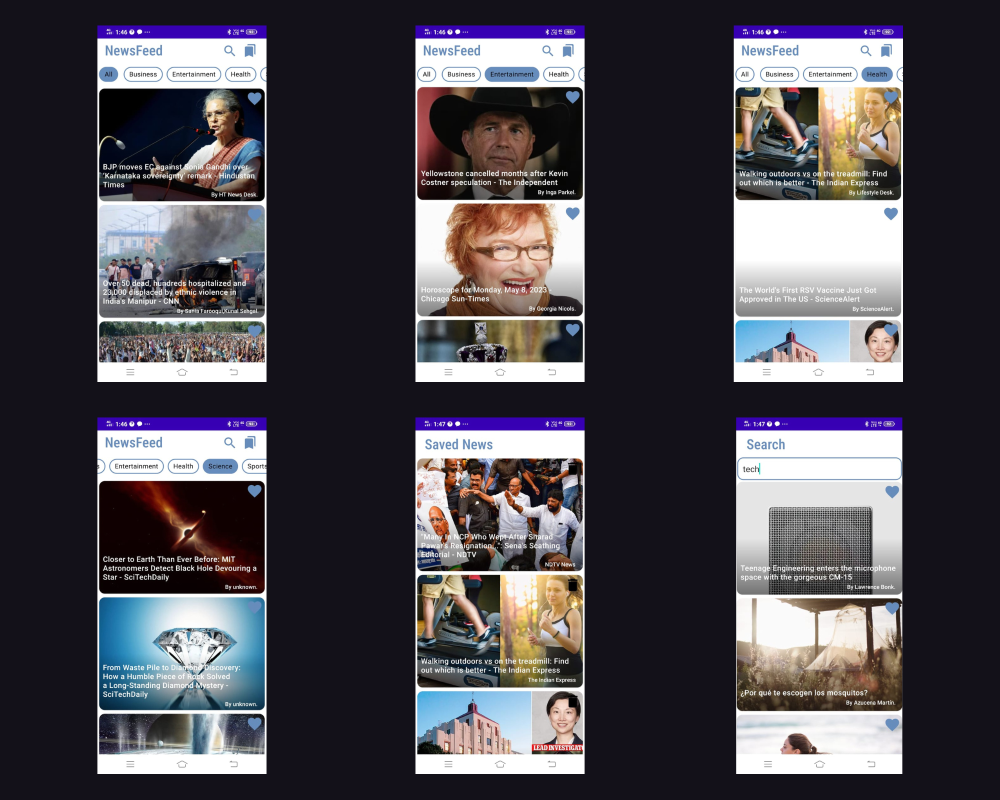

# NEWS_App
## Overview
Native Android Application that keeps the users up-to-date with the latest headlines.
## Features
* News displayed in various categories
* Users can save news offline to read and delete later
* Search news
* Browse news
## Screenshots

## Tech stack used:
* Kotlin
* XML
* MVVM Architecture
* ROOM persistence library
* Android Studio
* Retrofit for API
* News API
* Pagination
* Network Connectivity Manager
## Use this Application
* Click here to download the [APK](https://drive.google.com/file/d/1bOONo1Yedd47pdcCB4XOiODz41726aXq/view?usp=share_link)
* Or you can clone the repository and import in Android Studio to see the code + build the APK.
